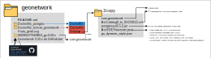
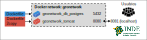
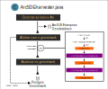

## O que falta?
 - os containers estão persistindo os dados?;
 - pedir confirmação do Carlos/Rodrigo/Klever (apoio do grupo);
 - commit final no GitLab Codex (finalizado!);
_____________________________________________________________________________
## Para que Geonetwork na CODEX?

Em nosso portfólio, significa facilitar a integração dos metadados de dados geoespaciais com a Infraestrutura Nacional de Dados Espaciais (INDE).

Nosso Geonetwork baseia-se na versão 3.10.x mantida no GitHub oficial, com adaptações nossas para integrar a tecnologia open-source com servidores ArcGIS Enterprise Geodatabase.

Possuímos uma implementação **1. Manual** e outra em **2. Docker** para facilitar a instalação em futuros clientes.
_____________________________________________________________________________
### 1. Abordagem Manual 

#### Diretório
Na branch manual, há um diretório 2copy e dois .bat: `2copy` tem arquivos modificados;
`1. Geonetwork 3.10.x do GitHub.bat` requer [git-bash](https://git-scm.com/download/win);
`2. Maven build and unzip.bat` requer [Maven 3](https://maven.apache.org/download.cgi) e [Java 8 com JDK](https://www.oracle.com/java/technologies/downloads/#java8-windows) (utilizei jdk-8u361-windows-x64.exe). No PATH (variáveis de ambiente) deve estar o caminho para o "bin" do Maven e do JDK para que "mvn" e "jar" seja acessível pelo .bat.
Além disso, para o banco de dados, será necessário instalar o [Postgres](https://www.postgresql.org/download/windows/),
mantendo usuário, senha e porta padrões "postgres", "admin" e "5432". Por fim, também instalar o Tomcat 8.5.

#### Como usar
* Baixar as dependências; 
* Setar variáveis de ambiente;
* Rodar em sequência os batch;
* Copiar a pasta `geonetwork` para a pasta `<TOMCAT_DIR>\webapps`;
* Entrar no postgres e criar database "gn";
* Abrir `<TOMCAT_DIR>\bin\Tomcat8w.exe`, permitir na aba Java ao menos `Initial memory pool: 2048 MB` e `Maximum memory pool: 4096 MB`, clicar OK;
* Por fim, duplo-clique em `<TOMCAT_DIR>\bin\Tomcat8.exe` para iniciar o Tomcat
* A aplicação estará exposta em `localhost:8080\geonetwork`;
_____________________________________________________________________________
### 2. Abordagem Docker

#### Diretório
Na branch docker, há um diretório com Dockerfile para cada imagem; 
 
um diretório .svg com imagens explicativas desse LEIAME; 
e um .bat (requer [git-bash](https://git-scm.com/download/win)) para clonar o código fonte do Geonetwork 3.10.x e salva em pasta "aaaammddThhmmss_gn-3.10.x" e também substitui o pg.version no pom.xml para o postgresql mais atual.
O Dockerfile do Tomcat com Geonetwork copia arquivos modificados armazenados no diretório `Dockerfile_tomcat/geonetwork/2copy`:

<div align="center"></div>

#### Como usar
* Instalar o [Docker Desktop](https://www.docker.com/products/docker-desktop/),
* Familiarizar-se com o Docker via [Tutorial](https://docs.docker.com/get-started/)
* Buildar as duas imagens
* Criar a rede comum
* Rodar os containers nela utilizando os comandos comentados nos respectivos Dockerfile.
<div align="center"></div>

#### Especificidades
Usamos o código fonte clonado do GitHub em 27/01/2023 às 16:38:13 da branch 3.10.x do Geonetwork, 
obtido via `Get new Geonetwork 3.10.x from GitHub.bat`. 
A pasta `20230127T163813_gn-3.10.x\core-geonetwork` está copiada para `Docker_tom_cat_geonetwork\2copy` 
onde também há arquivos modificados. 
O build é feito na imagem Docker, modificando o código fonte com os arquivos mencionados; 
o deploy ocorre via Tomcat 8.5 e é exposto na porta 8081. 
Querendo um dia utilizar outra versão do Geonetwork compatível com a que temos, 
devemos rodar `Get new Geonetwork 3.10.x from GitHub.bat` e substituir o `2copy\core-geonetwork`;
_____________________________________________________________________________
## Histórico
As implementações foram desenvolvidas no âmbito do projeto IDE-RJ do cliente CEPERJ

Período | Descrição
--- |---
09-10/2022 | `Carlos Henrique da Silva Barboza` e `Rodrigo Da Silva Santos` estudaram o Geonetwork, instalaram no CEPERJ a versão 3.12.6 com Jetty, adicionaram .jdbc atualizado do postgresql, encontraram o .xsl da 1a transformação e configuraram URL mais amigável ao usuário "https://gis-portal.westeurope.cloudapp.azure.com/geonetwork/".
01-02/2022 | `Juliano` partiu da branch 3.10.x do Geonetwork no GitHub, por essa ser mais próxima a versão 3.10.2 da INDE; com orientação de `Eduardo Appel`, revisou <ins>**Java**</ins> e aprendeu a realizar o processo de build com <ins>**Maven**</ins>; também identificou a necessidade do driver de conexão atualizado do postgresql; copiou, analisou, estudou e extendeu o .xsl encontrado por `Carlos`/`Rodrigo` para se adequar a campos identificados por `Bruno Palmas` como ainda então faltantes pós processo de harvest vindos de servidores PostgreSQL da tecnologia ESRI; com orientação de `Klever Correa da Silveira`, adaptou o desenvolvido para o universo <ins>**Docker**</ins> que simplifica o ajuste de dependências. Assim, implementar um Geonetwork resume-se em baixar o Docker Desktop, montar as duas imagens, uma rede em comum e carregar os dois containers com volume persistido; utilizou <ins>**código fonte**</ins> para adicionar funcionalidades ao geonetwork: codificação em UTF-8 no terminal, colher somente metadado com título, imprimir título no terminal, salvar .xml dos metadados, e se existente ajustar o formato de distribuição e resolução especial no .xml final;
_____________________________________________________________________________
### Dicas 

Há uma cópia de segurança do código fonte do GitHub oficial do Geonetwork 3.10.x da data 27/01/2023 às 16:38:13;

Buildar essa versão do Geonetwork utiliza [Maven 3](https://maven.apache.org/download.cgi)

`Buildar` `dentro` de docker-container demorava cerca de `880 s` enquanto `fora` `132 s`.

Os metadados colhidos pela classe `ArcSDEHarvester.java` são armazenados em elemento [JDOM](http://www.jdom.org/docs/apidocs.1.1/org/jdom/Element.html) durante processamentos e transformações.
Segue parte da abstração da classe:

<div align="center"></div>


_____________________________________________________________________________
### Segurança e aplicações padrão do Tomcat (*e.g.* Manager)
A equipe do Tomcat decidiu desativar as aplicações padrão para que o sistema não fique em risco se forem descobertas vulnerabilidades, uma vez que certas vulnerabilidades já foram descobertas nestas mesmas aplicações no passado.

De qualquer modo, para ativar as aplicações padrão do Tomcat e potencialmente colocar o sistema em risco, adicionar as seguintes linhas ao Dockerfile
```Dockerfile
# TOMCAT - Define user & allow access to manager
RUN mv $CATALINA_HOME/webapps.dist/* $CATALINA_HOME/webapps/
COPY 2copy/tomcat-users.xml $CATALINA_HOME/conf/tomcat-users.xml
COPY 2copy/context.xml $CATALINA_HOME/webapps/manager/META-INF/context.xml
```
