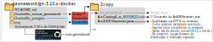

## Para que Geonetwork na CODEX?

Implementar o Geonetwork ao nosso portfólio de soluções significa integrar os metadados de dados geoespaciais com a Infraestrutura Nacional de Dados Espaciais e, assim, estar em consonância com esta obrigatoriedade em futuros editais.

Nosso Geonetwork baseia-se na versão 3.10.x mantida pelos desenvolvedores no GitHub, com algumas adaptações nossas à comunicação da tecnologia open-source e servidores ArcGIS Enterprise Geodatabase. Adotamos a ferramenta Docker para reduzir o tempo de implementação para futuros clientes.
_____________________________________________________________________________
### Como usar

Instalar o [Docker Desktop](https://www.docker.com/products/docker-desktop/), familiarizar-se com o Docker via [Tutorial](https://docs.docker.com/get-started/), buildar¹ as duas imagens, criar a rede comum e rodar os containers nela utilizando os comandos comentados nos respectivos Dockerfile. ¹transformar código fonte em código executável

<div align="center"></div>

### Especificidades
Usamos o código fonte clonado do GitHub em 27/01/2023 às 16:38:13 da branch 3.10.x do Geonetwork, obtido via `Get new Geonetwork 3.10.x from GitHub.bat`. A pasta `20230127T163813_gn-3.10.x\core-geonetwork` está copiada para `Docker_tom_cat_geonetwork\2copy` onde também há arquivos modificados. O build é feito na imagem Docker, modificando o código fonte com os arquivos mencionados; o deploy ocorre via Tomcat 8.5 e é exposto na porta 8081. Querendo um dia utilizar outra versão do Geonetwork compatível com a que temos, devemos rodar `Get new Geonetwork 3.10.x from GitHub.bat` e substituir o `core-geonetwork`;

_____________________________________________________________________________
## Descrição de diretório

Item | Descrição
--- |---
Dockerfile_postgres | Imagem docker para o database postgres onde Geonetwork armazena os metadados.
Dockerfile_tomcat_geonetwork | Imagem docker para o geonetwork com tomcat.
20230127T163813_gn-3.10.x | Cópia 27/01/2023 16h38m13 do Geonetwork 3.10.x obtida do GitHub utilizando git-bash.
Geonetwork 3.10.x do GitHub.bat | pega o código fonte do Geonetwork 3.10.x e salva em pasta "aaaammddThhmmss_gn-3.10.x". Também substituit pg.version no pom.xml para o postgresql mais atual. Necessário instalar git-bash (https://git-scm.com/download/win)
svg | Imagens explicativas

#### Arquivos modificados em `Dockerfile_tomcat/geonetwork/2copy`
Item | Descrição
--- |---
core-geonetwork                       | Código fonte
ArcSDEHarvester.java                  | Mudanças na classe
ArcCatalog8_to_ISO19115.xsl           | Conversão desenvolvida para Geonetwork-ArcGIS
ArcCatalog8_to_ISO19115_TI.xsl        | Conversão encontrada pela TI
postgresql-42.5.2.jar                 | Driver atualiado de conexão com db postgresql
context.xml e tomcat-users.xml        | Caso necessário acessar Default Apps do Tomcat

<div align="center"></div>

_____________________________________________________________________________
## Histórico
Período | Descrição
--- |---
09-10/2022 | `Carlos Henrique da Silva Barboza` e `Rodrigo Da Silva Santos` estudaram e instalaram geonetwork 3.12.6 com Jetty, adicionaram .jdbc atualizado do postgresql, encontraram o .xsl da 1a transformação e configuraram URL mais amigável ao usuário "https://gis-portal.westeurope.cloudapp.azure.com/geonetwork/".
01-02/2022 | `Juliano` partiu do <ins>**código fonte**</ins>, da branch 3.10.x do Geonetwork no GitHub, por essa ser mais próxima a versão 3.10.2 da INDE; com orientação de `Eduardo Appel`, revisou <ins>**Java**</ins> e aprendeu a realizar o processo de build com <ins>**Maven**</ins>; identificou a necessidade de adicionar o driver de conexão atualizado do postgresql (necessidade essa confirmada posteriormente pela TI); copiou, analisou, estudou e extendeu o .xsl encontrado por `Carlos`/`Rodrigo` para se adequar a campos identificados por Bruno como ainda então faltantes pós processo de harvest vindos de servidores PostgreSQL da tecnologia ESRI; com orientação de `Klever Correa da Silveira`, adaptou o desenvolvido para o universo <ins>**Docker**</ins> que simplifica o ajuste de dependências. Assim, implementar um Geonetwork resume-se em baixar o Docker Desktop, montar as duas imagens, uma rede em comum e carregar os dois containers com volume persistido.

_____________________________________________________________________________

### Dicas 
Buildar dentro da imagem toma cerca de 880 s; fora, 132 s. Essa versão do Geonetwork utiliza [Maven 3 para buildar](https://maven.apache.org/download.cgi)

Os metadados colhidos pela classe `ArcSDEHarvester.java` são armazenados em elemento [JDOM](http://www.jdom.org/docs/apidocs.1.1/org/jdom/Element.html) durante processamentos e transformações.

<div align="center"></div>

_____________________________________________________________________________
### Segurança e aplicações padrão do Tomcat (*e.g.* Manager)
A equipe do Tomcat decidiu desativar as aplicações padrão para que o sistema não fique em risco se forem descobertas vulnerabilidades, uma vez que certas vulnerabilidades já foram descobertas nestas mesmas aplicações no passado.

De qualquer modo, para ativar as aplicações padrão do Tomcat e potencialmente colocar o sistema em risco, adicionar as seguintes linhas ao Dockerfile
```Dockerfile
# TOMCAT - Define user & allow access to manager
RUN mv $CATALINA_HOME/webapps.dist/* $CATALINA_HOME/webapps/
COPY 2copy/tomcat-users.xml $CATALINA_HOME/conf/tomcat-users.xml
COPY 2copy/context.xml $CATALINA_HOME/webapps/manager/META-INF/context.xml
```

_____________________________________________________________________________
## O que falta?
 - os containers estão persistindo os dados?;
 - alinhar esse .md com a Geo;
 - commit privado no meu GitHub com data (sim, eu fiz);
 - commit no GitLab Codex (compartilhar);
 - pedir confirmação do Carlos/Rodrigo/Klever (apoio do grupo);
 - commit final no GitLab Codex (finalizado!);